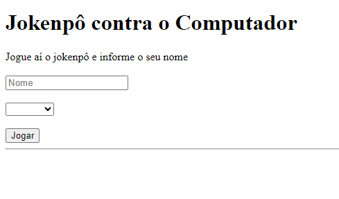
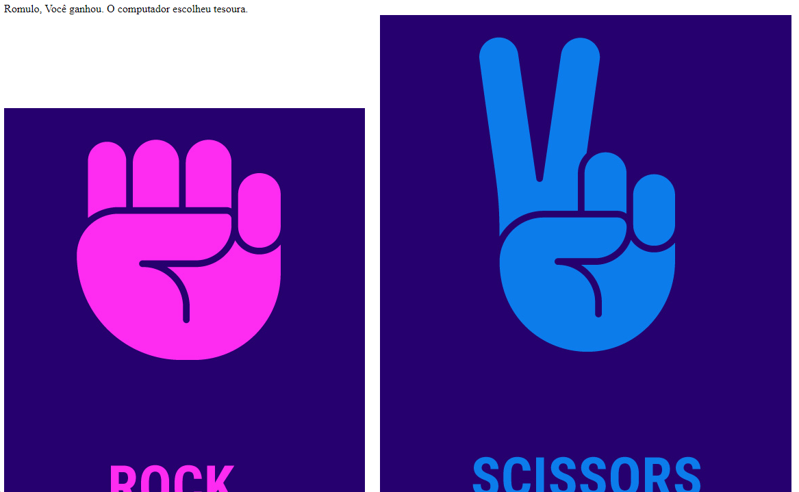
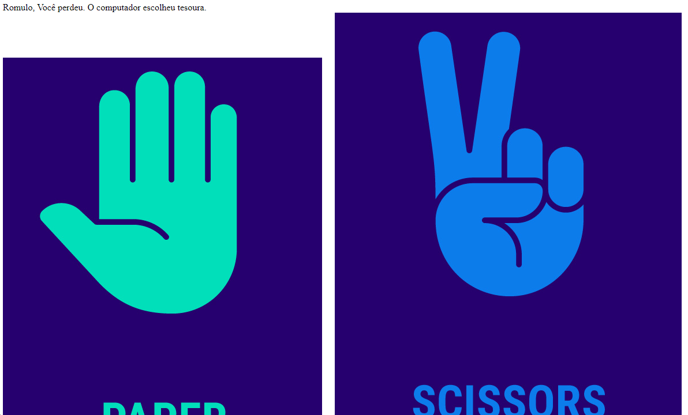
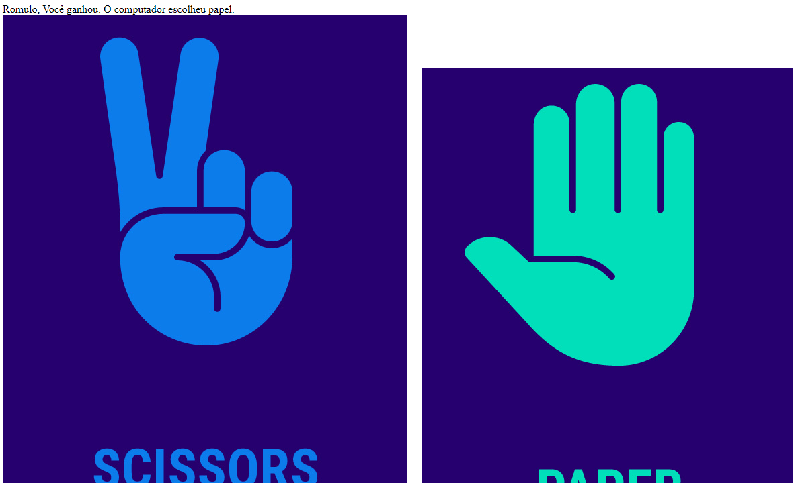

# poo_jokenpo
Um jogo de jokenpo feito em php que foi refatorado para funcionar com programação orientada a objetos. atividade de Web II do curso de DS da Etec de Guarulhos.
  

  <h3>Em um select, você escolhe a sua jogada e dá o seu nome</h3>
  

  

  <h3>As classes de POO fazem a magia. Aqui algumas das minhas jogadas:</h3>
  

